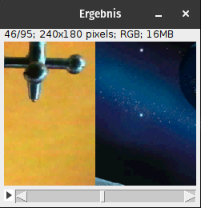
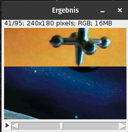
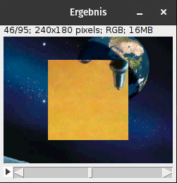
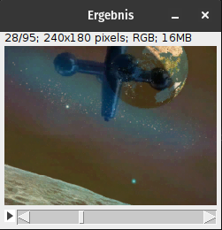
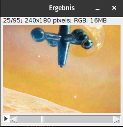
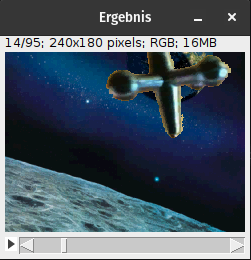

# Digital Media

This course explored key concepts in digital image processing and transmission, including:

- **Image Transmission Principles**: Digitization, quantization, and quantization curves.
- **Color Representation**: Color spaces, color depth, and gamut.
- **Resolution**: Definition of resolution, pixel density (PPI), and bit depth per image.
- **Image Organization**: Various pixel layouts (progressive, interleaved), and interlaced vs non-interlaced formats.
- **Compression**: Overview of image compression techniques and formats.
- **Image Operations**: Bitonal image processing, neighborhood operations, and geometric transformations.
- **Internet Formats**: Handling images for the web and progressive image formats.

This course provided a comprehensive understanding of the technical aspects of digital media processing.

Here ive Uploaded one of the labs. Be ware that in order for it to work ImageJ needs to be installed and refrenced as a libary.
For the Lab our task was to create visual video overlay effects, ranging from a simple sliding effect to Chroma Keying.

